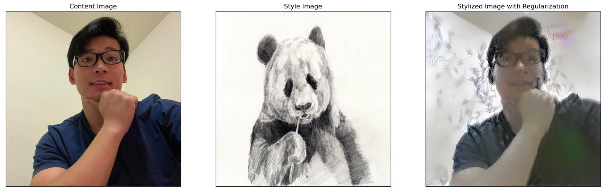

# Fast Neural_Style_Transfer

`Neural_Style_Transfer_From_Scratch.ipynb` shows how to build a neural style transfer model from scratch using vgg16. 
`image_utils.py` contains the data and image processing functions.
The content, style image and the transfered image: 

`Fast_Neural_Style_Transfer.ipynb` uses available [model from Tensorflow Hub](https://tfhub.dev/google/magenta/arbitrary-image-stylization-v1-256/2) and apply it to the images style transfer

The content, style image and the transfered image: 

